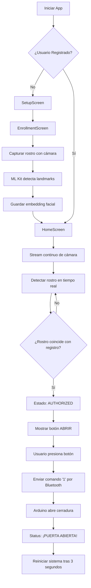

# 🔐 BioLock - Sistema de Acceso por Reconocimiento Facial

## 📋 Descripción

**BioLock** es un sistema inteligente de acceso que combina:
- **IA**: Reconocimiento facial con Google ML Kit
- **IoT**: Conexión Bluetooth con Arduino
- **Ciberseguridad**: Autenticación biométrica

El sistema captura tu rostro con la cámara frontal del smartphone, lo compara con tu registro biométrico y si coinciden, envía un comando por Bluetooth para abrir una cerradura electromagnética controlada por Arduino.

---

## 🏗️ Arquitectura del Proyecto

```
lib/
├── config/           # Configuración global
│   └── app_config.dart
├── models/           # Modelos de datos
│   └── app_state.dart
├── screens/          # Pantallas principales
│   ├── home_screen.dart
│   ├── enrollment_screen.dart
│   └── setup_screen.dart
├── services/         # Lógica de negocio
│   ├── camera_service.dart
│   ├── face_detection_service.dart
│   ├── bluetooth_service.dart
│   ├── auth_service.dart
│   └── service_locator.dart (Inyección de dependencias)
├── utils/            # Utilidades
│   ├── constants.dart
│   ├── themes.dart
│   └── logger.dart
├── widgets/          # Widgets reutilizables
│   ├── camera_preview_widget.dart
│   ├── status_indicator.dart
│   └── unlock_button.dart
└── main.dart         # Punto de entrada
```

---

## 🔧 Requisitos

**Android:**
- Android 5.0 (API 21) o superior
- Cámara frontal
- Bluetooth integrado

**Dependencias instaladas:**
- `camera: ^0.11.1` - Acceso a cámara
- `google_mlkit_face_detection: ^0.7.0` - IA de reconocimiento facial
- `flutter_bluetooth_serial: ^0.4.0` - Comunicación Bluetooth
- `permission_handler: ^11.4.4` - Gestión de permisos
- `provider: ^6.1.0` - Gestión de estado
- `logger: ^2.4.0` - Logging

---

## 📱 Pasos para Compilar y Ejecutar

### 1. Limpiar y Preparar el Proyecto
```bash
cd biolock_web
flutter clean
flutter pub get
```

### 2. Compilar APK (Modo Debug)
```bash
flutter build apk --debug
```

**Ubicación del APK:** `build/app/outputs/flutter-apk/app-debug.apk`

### 3. Instalar en Dispositivo
```bash
flutter install
```

O directamente:
```bash
adb install build/app/outputs/flutter-apk/app-debug.apk
```

### 4. Ejecutar en Modo Desarrollo
```bash
flutter run
```

### 5. Compilar APK de Producción
```bash
flutter build apk --release
```

**Ubicación:** `build/app/outputs/flutter-apk/app-release.apk`

---

## 🤖 Configuración del Hardware Arduino

### Hardware Necesario
- Arduino Uno/Nano
- Módulo Bluetooth HC-05
- Relé (Relay Module)
- Cerradura Solenoide 12V
- Fuente de 12V

### Conexiones
```
HC-05 Bluetooth:
  VCC      → 5V
  GND      → GND
  TX       → Pin 10 (RX de Arduino)
  RX       → Pin 11 (TX de Arduino)

Relé:
  VCC      → 5V
  GND      → GND
  IN       → Pin 2

Solenoide:
  Conectar a puerto NO (Normally Open) del Relé
  Alimentación: 12V externa
```

### Código Arduino
```cpp
#include <SoftwareSerial.h>

SoftwareSerial bluetooth(10, 11); // RX, TX
const int relayPin = 2;

void setup() {
  pinMode(relayPin, OUTPUT);
  digitalWrite(relayPin, HIGH); // Relay desactivado
  bluetooth.begin(9600);
  Serial.begin(9600);
}

void loop() {
  if (bluetooth.available()) {
    char command = bluetooth.read();
    if (command == '1') { // Comando de apertura desde Flutter
      digitalWrite(relayPin, LOW);  // Activar relé
      Serial.println("✓ Cerradura abierta");
      delay(3000);                  // Mantener 3 segundos
      digitalWrite(relayPin, HIGH); // Desactivar relé
    }
  }
}
```

---

## 🔐 Flujo de Autenticación



---

## 🎯 Características Implementadas

✅ **Captura de cámara en tiempo real**
✅ **Detección de rostros con ML Kit**
✅ **Reconocimiento facial con confianza ajustable**
✅ **Conexión Bluetooth con Arduino**
✅ **Envío de comandos al relé**
✅ **UI moderna con Material Design 3**
✅ **Pantalla de registro (Enrollment)**
✅ **Gestión de estados inteligente**
✅ **Manejo de permisos automático**
✅ **Logging completo para debugging**
✅ **Inyección de dependencias con GetIt**

---

## 🚀 Características Futuras (Presentación)

### Seguridad Avanzada
- **Liveness Detection**: Detectar si es una foto/video
- **Anti-Spoofing**: Validar que es una persona real
- **Encriptación end-to-end** de datos biométricos

### Integración IoT
- **Control de hogar inteligente**: Ajustar luces, temperatura
- **Registro en la nube**: Firebase para auditoría
- **Notificaciones en tiempo real** de accesos

### Aplicaciones Comerciales
- **Hospitales**: Acceso estéril a quirófanos
- **Bancos**: Bóveda segura biométrica
- **Fábricas**: Control de zonas de riesgo
- **Hoteles/Airbnb**: Check-in automático
- **Autos inteligentes**: Encendido por rostro

---

## 🐛 Troubleshooting

### Error: "No cameras found"
- Verificar que el dispositivo tiene cámara frontal
- Reiniciar la app

### Error: "Bluetooth connection failed"
- Emparejar dispositivo HC-05 primero
- Verificar que el Arduino está encendido
- Comprobar conexiones de hardware

### Error: "Permission denied"
- Otorgar permisos manuales en Configuración > Apps > BioLock
- Reinstalar la app

### Reconocimiento facial no funciona
- Asegurar buena iluminación
- Colocarse frente a la cámara
- Verificar que Google ML Kit está instalado

---

## 📊 Métricas de Confianza

- **Umbral de confianza**: 75% (ajustable en `app_config.dart`)
- **Landmarks comparados**: Todos los puntos faciales detectados
- **Distancia máxima**: Se calcula basada en desviación de landmarks

---

## 📞 Contacto y Soporte

Este proyecto fue desarrollado para **Tecnologías Emergentes - SIS427**.

Para más información sobre:
- **IA/ML**: Consulta `FaceDetectionService`
- **IoT**: Consulta `BluetoothService`
- **Ciberseguridad**: Consulta `AuthService`

---

## 📄 Licencia

MIT - Libre para uso educativo y comercial
