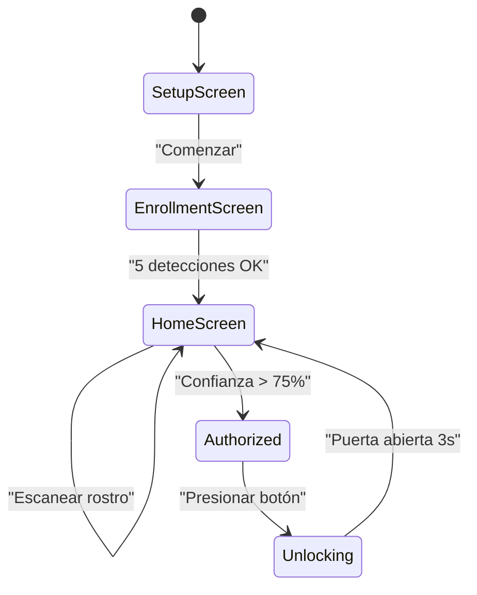

# 🔐 BioLock - Sistema de Acceso por Reconocimiento Facial

[](https://flutter.dev)
[](https://www.android.com)
[](LICENSE)
[]()

> **Sistema convergente de IA, IoT y Ciberseguridad** que proporciona acceso controlado mediante reconocimiento facial biométrico integrado con hardware Arduino.

## 🎯 Descripción

BioLock es una solución de acceso inteligente que utiliza:

- 🧠 **IA**: Reconocimiento facial con Google ML Kit
- 📱 **Flutter**: Desarrollo multiplataforma (Android/iOS)
- 🔌 **IoT**: Conexión Bluetooth con Arduino HC-05
- 🔒 **Ciberseguridad**: Autenticación biométrica segura
- ⚙️ **Hardware**: Control de cerraduras electromagnéticas

### Flujo Principal
```
📷 Captura rostro → 🧠 ML Kit detecta características → 
✅ Compara con registro → 📡 Envía comando Bluetooth → 
🔓 Arduino abre cerradura
```

---

## 🚀 Inicio Rápido

### Requisitos Previos
- Flutter 3.11+ instalado
- Android SDK 21+ (API 21)
- Dispositivo Android con Bluetooth y cámara frontal
- Git (opcional)

### Instalación

#### 1. Clonar o descargar el proyecto
```bash
cd biolock_web
```

#### 2. Preparar dependencias (Windows)
```bash
flutter clean
flutter pub get
```


#### 3. Compilar e Instalar
```bash
# Conectar dispositivo Android
adb devices

# Compilar y instalar
flutter run
```

---

## 📁 Estructura del Proyecto

```
lib/
├── config/
│   ├── app_config.dart          # Configuración global
│
├── models/
│   └── app_state.dart           # Enums y modelos de datos
│
├── screens/                      # 3 pantallas principales
│   ├── setup_screen.dart        # Pantalla de bienvenida
│   ├── enrollment_screen.dart   # Registro biométrico
│   └── home_screen.dart         # Sistema principal
│
├── services/                     # Lógica de negocio (inyección DI)
│   ├── camera_service.dart
│   ├── face_detection_service.dart
│   ├── bluetooth_service.dart
│   ├── auth_service.dart
│   └── service_locator.dart
│
├── utils/
│   ├── constants.dart
│   ├── themes.dart
│   └── logger.dart
│
├── widgets/                      # Componentes reutilizables
│   ├── camera_preview_widget.dart
│   ├── status_indicator.dart
│   └── unlock_button.dart
│
└── main.dart                     # Punto de entrada

android/
└── app/src/main/
    └── AndroidManifest.xml      # Permisos configurados
```

---

## 🔧 Dependencias

| Paquete | Versión | Propósito |
|---------|---------|----------|
| `camera` | 0.11.1 | Captura de video |
| `google_mlkit_face_detection` | 0.7.0 | Reconocimiento facial IA |
| `flutter_bluetooth_serial` | 0.4.0 | Comunicación Bluetooth |
| `permission_handler` | 11.4.4 | Gestión de permisos |
| `get_it` | 7.6.0 | Inyección de dependencias |
| `provider` | 6.1.0 | State management |
| `logger` | 2.4.0 | Logging avanzado |

---

## 🤖 Flujo de Funcionamiento

### Diagrama de Estados



### Diagrama de Componentes

```mermaid
graph LR
    App["Flutter App"]
    Camera["📷 CameraService"]
    ML["🧠 ML Kit"]
    Auth["🔐 AuthService"]
    BT["📡 BluetoothService"]
    Arduino["🤖 Arduino HC-05"]
    
    App -->|frames| Camera
    Camera -->|CameraImage| ML
    ML -->|Face landmarks| Auth
    Auth -->|autorización| BT
    BT -->|comando '1'| Arduino
    Arduino -->|relé| Puerta["🔓 Cerradura"]
```



---

## 🛠️ Configuración de Hardware

### Conexiones Arduino

```
HC-05 Bluetooth Module:
  VCC  → 5V
  GND  → GND
  TX   → Pin 10 (RX del Arduino)
  RX   → Pin 11 (TX del Arduino)

Relay Module (5V):
  VCC  → 5V
  GND  → GND
  IN   → Pin 2

Electromagnetic Solenoid (12V):
  Conectar en puerto NO (Normally Open) del Relay
  Alimentación: Fuente externa 12V
```

### Código Arduino Requerido

```cpp
#include <SoftwareSerial.h>

SoftwareSerial bluetooth(10, 11); // RX, TX
const int relayPin = 2;

void setup() {
  pinMode(relayPin, OUTPUT);
  digitalWrite(relayPin, HIGH); // Relay desactivado
  bluetooth.begin(9600);
  Serial.begin(9600);
}

void loop() {
  if (bluetooth.available()) {
    char command = bluetooth.read();
    if (command == '1') { // Comando desde Flutter
      digitalWrite(relayPin, LOW);  // Abrir
      delay(3000);                  // 3 segundos
      digitalWrite(relayPin, HIGH); // Cerrar
    }
  }
}
```

---

## 🎨 Características Implementadas

✅ **Captura de Cámara**
- Stream en tiempo real desde cámara frontal
- Inicialización automática de permisos
- Resolución adaptable (low, medium, high)

✅ **Detección Facial (ML Kit)**
- Detección de rostros en tiempo real
- Extracción de 68+ landmarks (puntos faciales)
- Comparación de características

✅ **Autenticación Biométrica**
- Registro de usuario con 5 detecciones
- Comparación de distancia de landmarks
- Umbral de confianza configurablea (75% por defecto)
- Auditoría de accesos

✅ **Bluetooth**
- Conexión con HC-05
- Envío de comandos seriales ('1' para abrir)
- Descubrimiento automático de dispositivos

✅ **UI/UX**
- Material Design 3
- Tema oscuro profesional
- Animaciones fluidas
- Feedback visual en tiempo real
- Setup guiado

✅ **Arquitectura**
- Inyección de dependencias con GetIt
- Separación clara de responsabilidades
- Services, Models, Screens, Widgets
- Logging completo para debugging
- Manejo de errores robusto

---

## 📱 Permisos Configurados

```xml
<!-- Cámara -->
<uses-permission android:name="android.permission.CAMERA"/>

<!-- Bluetooth -->
<uses-permission android:name="android.permission.BLUETOOTH"/>
<uses-permission android:name="android.permission.BLUETOOTH_ADMIN"/>
<uses-permission android:name="android.permission.BLUETOOTH_CONNECT"/>
<uses-permission android:name="android.permission.BLUETOOTH_SCAN"/>

<!-- Almacenamiento -->
<uses-permission android:name="android.permission.READ_EXTERNAL_STORAGE"/>
<uses-permission android:name="android.permission.WRITE_EXTERNAL_STORAGE"/>

<!-- Hardware Requirements -->
<uses-feature android:name="android.hardware.camera" android:required="true"/>
<uses-feature android:name="android.hardware.bluetooth" android:required="true"/>
```

---

## 🎯 Casos de Uso

| Sector | Aplicación |
|--------|-----------|
| 🏥 **Salud** | Acceso a quirófanos y laboratorios estériles |
| 🏦 **Banca** | Bóvedas y acceso a zonas restringidas |
| 🏢 **Oficinas** | Control de personal y auditoría automática |
| 🏭 **Industria** | Prevención de accidentes en zonas peligrosas |
| 🏨 **Hoteles** | Check-in remoto sin llaves físicas |
| 🚗 **Automoción** | Encendido y configuración adaptativas |
| ♿ **Accesibilidad** | Autonomía para personas con limitaciones motoras |

---

## 🚀 Roadmap Futuro

- [ ] Liveness Detection (detectar fotos/videos)
- [ ] Multi-usuario con base de datos Firebase
- [ ] Historial de accesos en la nube
- [ ] Integración con Smart Home
- [ ] Detección de emociones
- [ ] Visión nocturna (IR)
- [ ] Anti-spoofing mejorado
- [ ] Autenticación 2FA

---

## 🐛 Troubleshooting

### Error: "No cameras found"
```
Solución: Verificar que el dispositivo tiene cámara frontal
          Reiniciar la app
```

### Error: "Bluetooth connection failed"
```
Solución: 1. Emparejar HC-05 en Configuración > Dispositivos
          2. Verificar que Arduino está encendido
          3. Revisar conexiones de hardware
```

### Error: "Permission denied"
```
Solución: Otorgar permisos en Sistema > Aplicaciones > BioLock
          Permisos > Cámara y Bluetooth
```

### Face Recognition no funciona
```
Solución: 1. Mejorar iluminación del ambiente
          2. Colocarse directamente frente a la cámara
          3. Reducir la distancia a ~30-50cm
          4. Verificar que Google ML Kit esté instalado
```

---

## 📊 Especificaciones Técnicas

| Aspecto | Valor |
|--------|-------|
| **Android Mínimo** | 5.0 (API 21) |
| **Tiempo de Detección** | ~500ms |
| **Confianza Mínima** | 75% (configurable) |
| **Duración de Apertura** | 3 segundos |
| **Landmarks Faciales** | 68+ puntos |
| **Baudrate Bluetooth** | 9600 bps |
| **Arquitectura** | Inyección de dependencias |

---

## 🔐 Seguridad

✅ **Privacidad Local**
- IA procesa en el dispositivo, no en la nube
- No envía fotos, solo características extraídas
- No se guardan datos en servidores sin consentimiento

✅ **Autenticación Segura**
- Biometría única e irrepetible
- Imposible duplicar (a diferencia de contraseñas)
- Auditoría automática de cada acceso

✅ **Hardware Seguro**
- Comunicación encriptable con Arduino
- Futuro: SSL/TLS para conexiones en la nube
- Compatible con perfiles de privacidad estrictos

---

## 👥 Contribuciones

Este proyecto fue desarrollado como trabajo de **Tecnologías Emergentes (SIS427)**.

Agradecimientos especiales a:
- Google ML Kit Team
- Flutter Community
- Arduino Community

---

## 📄 Licencia

Este proyecto está bajo licencia **MIT**. Libre para uso educativo, comercial y personal.

```
MIT License - Copyright (c) 2024

Se permite el uso libremente con la condición de incluir el aviso de copyright.
```

---

## 📞 Contacto

- 📧 Email: [Tu email]
- 💻 GitHub: [Tu repositorio]
- 📱 LinkedIn: [Tu perfil]

---

## 🙏 Agradecimientos

- **Google**: ML Kit para visión computacional
- **Flutter Team**: Framework multiplataforma
- **Arduino Community**: Hardware open-source
- **Mi profesor**: Por la orientación en Tecnologías Emergentes

---

**Hecho con ❤️ para la seguridad del futuro.**

_Última actualización: 2024_

## Getting Started

This project is a starting point for a Flutter application.

A few resources to get you started if this is your first Flutter project:

- [Learn Flutter](https://docs.flutter.dev/get-started/learn-flutter)
- [Write your first Flutter app](https://docs.flutter.dev/get-started/codelab)
- [Flutter learning resources](https://docs.flutter.dev/reference/learning-resources)

For help getting started with Flutter development, view the
[online documentation](https://docs.flutter.dev/), which offers tutorials,
samples, guidance on mobile development, and a full API reference.
